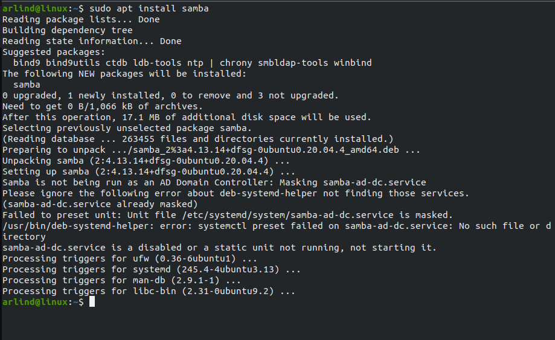
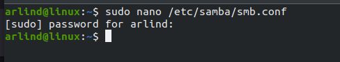
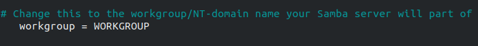
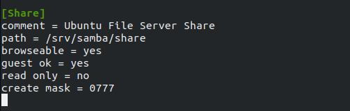
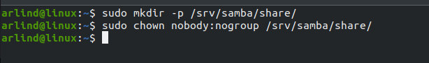
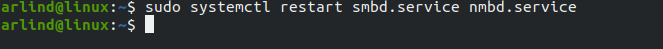
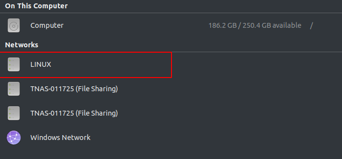
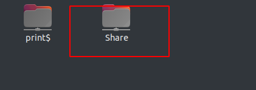
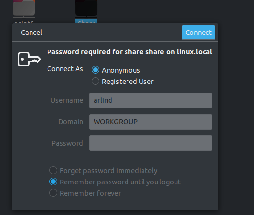
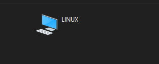

- [How to configure a file share server using samba](#how-to-configure-a-file-share-server-using-samba)
  - [Installation](#installation)
  - [Configuration](#configuration)
    - [Edit the smb.conf file](#edit-the-smbconf-file)
    - [Create the directory tree](#create-the-directory-tree)
    - [Restart Samba](#restart-samba)
    - [Finally check to see if the server is configured correctly](#finally-check-to-see-if-the-server-is-configured-correctly)
  - [Congratulations you have now learned how to create a file server using samba on Linux](#congratulations-you-have-now-learned-how-to-create-a-file-server-using-samba-on-linux)
  - [Work Cited](#work-cited)

# How to configure a file share server using samba
## Installation
* First you are going to need to install samba on your linux system.
* This command shows you how to install samba on your linux system

## Configuration

### Edit the smb.conf file
* First you are going to have to edit the smb.conf file in order to start setting up your file share server
* This command shows you hot to enter the file to edit

* First make sure you have a workgroup assigned in order for it to be accessible for you home network

* Then you are going to need to create a section at the end of the file fo be able to share the directory
* Comment- A short description of the share. Adjust to fit your needs.
* Path- The path to the directory you are sharing
* Browseable- Enables Windows clients to browse the shared directory using windows explorer
* Guest ok- Allows clients to connect to the share folder without supplying a password
* Read-only- Determines if the share is read only or if write privileges are granted. Write privileges are allowed only when the value is no. If the value is set to yes, then access to the share is read only.
* Create mask- Determines the permissions new files will have when they are created.

### Create the directory tree
* Then you are going to have to create the directory and/or directory tree and the permission changed
* These two commands shows you how to create the directory and change the permissions

### Restart Samba
* Finally you will have to restart samba for all the changes to take effect
* This command show you how to restart samba

### Finally check to see if the server is configured correctly

* You can choose to enter anonymously or a registered user

## Congratulations you have now learned how to create a file server using samba on Linux

## Work Cited

“Linux Samba File Server Setup Checklist.” Process Street, 7 Feb. 2018, https://www.process.st/checklist linux-samba-file-server-setup-checklist/.

“Samba - File Server.” Ubuntu, https://ubuntu.com/server/docs/samba-file-server.
