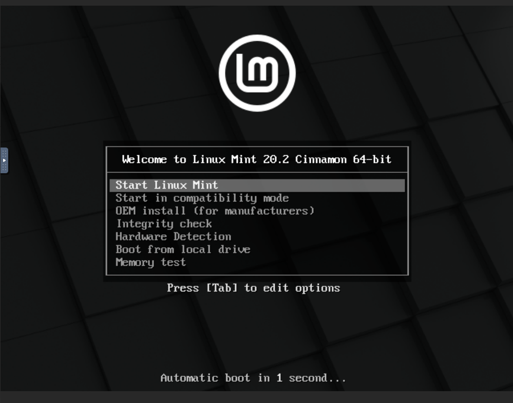
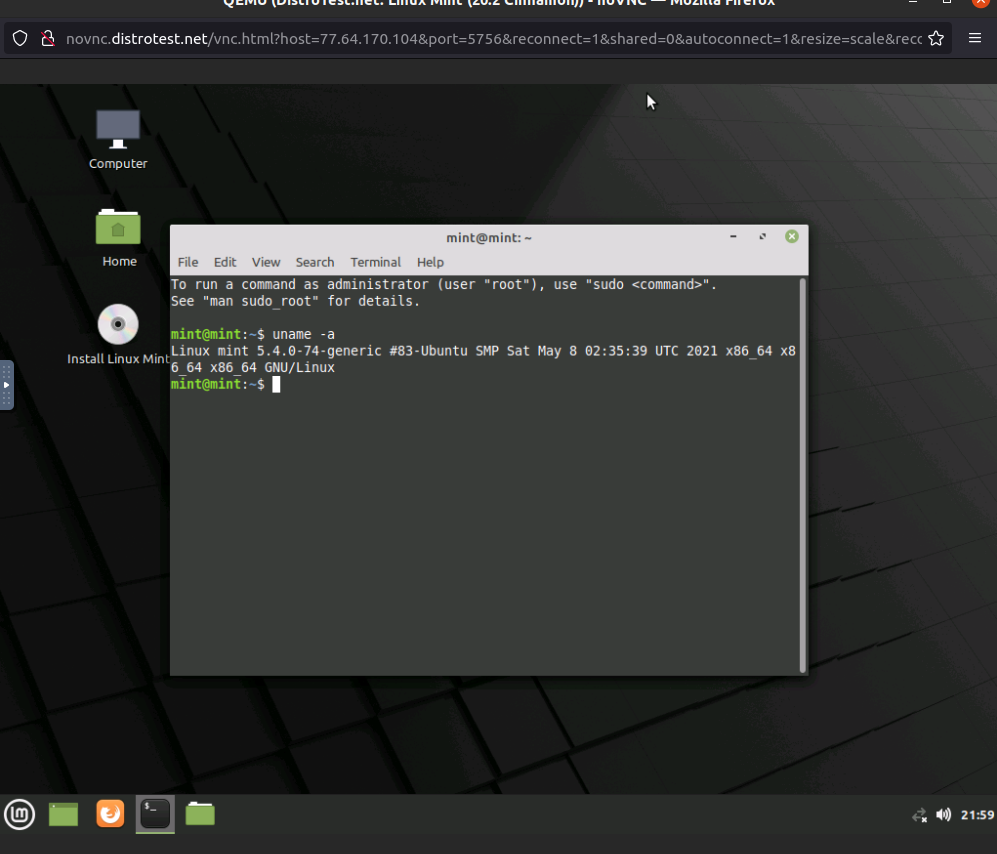
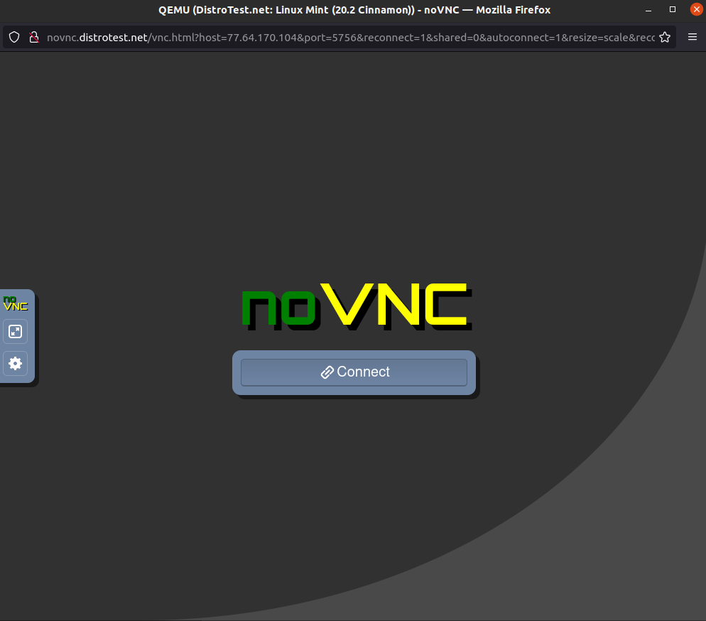

## Working with Distrowatch
---
### Question 1
During class, we explored the concept of Linux distribution. During this lab, you will research some Linux distributions using a website called Distrowatch. DistroWatch is a website that provides news, popularity rankings, and other general information about various Linux distributions and other Unix-like operating systems such as OpenSolaris, MINIX and BSD. 

Go to [Distrowatch](https://distrowatch.com/). Explore the website to get familiar with the home page. On the top left corner, you have a form that allows you to submit queries to the website. In the **“Type Distribution Name”** box type **“Ubuntu”.**  This will return details about Ubuntu. Explore the Ubuntu Distrowatch page and answer the following questions:

1. What is the OS Type: 
   * **Linux**

2. Which major distro is it based on?  
   * **Debian**
   
3. Which processor architecture does it support?  
   * **powerpc, i686, s390x, x86_64, ppc64el, armhf**

4. Is the distribution active or is it discontinued?  
   * **Active**

5. What is the distro’s home page?  
   * **https://www.ubuntu.com/**

### Question 2
On the top left corner, click on “Random Distribution” and answer the following questions from the distro you got.
1. What is the name of the distribution and the OS Type: 
   * **XigmaNAS**

2. Which major distro is it based on?  
   * **FreeBSD**
   
3. Which processor architecture does it support?  
   * **x86_64**

4. Is the distribution active or is it discontinued?  
   * **Active**

5. What is the distro’s home page?  
   * **https://www.xigmanas.com/**

### Question 3
On the top of the page, right in the middle, you will find an option that allows you to search for distributions. 
Click on **“Search”** and after the page loads, fill in the following information in the **“Search Distribution by Criteria”** section and Click on Submit Query.
* OS Type: Linux
* Architecture: x86_64
* Status: Active
* Leave the rest as default.

From the query results, choose any distribution and answer the following question about the distro you chose.

1. What is the name of the distribution? 
   * **MX Linux**
  
2. What is the country of Origin?
   * **Greece**
  
3. What major distribution is it based on?
   * **Debian(Stable), antiX**

4. What is the distribution category?
   * **Desktop, From RAM, Live Medium, Raspberry Pi**
  
5. Which processor architecture, aside from the one in the original query, does the OS support?
   * **am=rmhf, i686, x86_64**

### Question 4
Now that you know how to use Distrowatch. Find a Linux distribution for the following scenarios. For each distribution provide the website, name, and supported architecture.

1. A Linux distribution used for Data Rescue/Data recovery
* Distro Name: **Kali Linux**
* Website: **https://www.kali.org/**
* Desktop Environment: **Enlightenment, GNOME, KDE Plasma, LXDE, Mate, Xfce**

2. A Linux distribution used for Education that supports the ix86 processor architecture.
* Distro Name: **NixOS**
* Website: **https://nixos.org/**
* Desktop Environment: **Awesome, Enlightenment, Flixbox, GNOME, i3, IceWM, KDE Plasma, Ratpoison, Xfce**

3. A Linux distribution that supports the OEM installation method
* Distro Name: **Linux Mint**
* Website: **https://linuxmint.com/**
* Desktop Environment: **Cinnamon, Mate, Xfce**

### Question 5 (Extra credit 2 pts - Optional)
On the Distrowatch homepage in the menu located in the middle of the page, you will find an option called **“Submit Distribution”.** This option lists all the Linux distros that are pending evaluation, on development or that are experiencing some sort of legal constraint.  Select one of these distributions and in a paragraph, share your thoughts. (keep it simple 5 to 8 sentences).
**Type your paragraph here**

## Working with DistroTest.net
### Question 6
DistroTest.net is a project that allows you to test Linux/BSD distributions on your web browser. This website is great for trying out distributions before you even download the ISO file. Go to [Distrotest.net](https://distrotest.net/) and click on any of the distributions. Start the distribution and take a screenshot of the browser window that just popped up.

****

Locate the terminal application in the distribution you started and type the following command: `uname -a` Take a screenshot of the browser window showing the terminal application open.

****

Stop the machine and take a screenshot of the browser window showing that the machine has been stopped.

****
